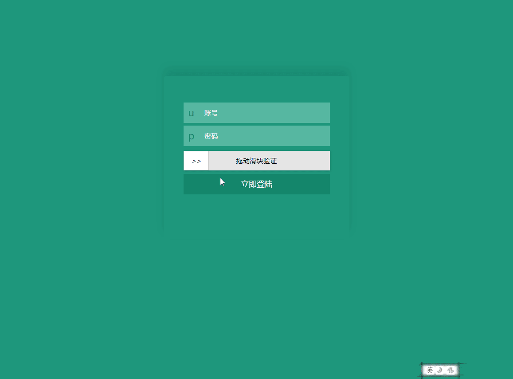

# VerificationCode
简单的验证码生成，校验

## Quick Start
### 1. Install-Package VerificationCode -Version 1.2.0
### 2. 添加session支持
```csharp
   public void ConfigureServices(IServiceCollection services)
   {
            services.AddSession(); //需要添加Session
   }
```
### 3. 添加验证码组件
```csharp
   public void Configure(IApplicationBuilder app, IHostingEnvironment env)
   {
            app.UseCookiePolicy();
            app.UseSession();
            //添加中间件扩展
            app.UseVerificationCode(p =>
            {
                //配置验证字典
                p.Keys = new List<string> { "A", "B", "C", "D", "E", "F", "G", "H", "I", "J", "K" }; 
                //配置背景图片地址
                p.ImagePath = Environment.CurrentDirectory + "\\wwwroot\\images\\codeImage\\";      
            });
            app.UseMvc(routes =>
            {
                routes.MapRoute(
                    name: "default",
                    template: "{controller=Home}/{action=Index}/{id?}");
            });
      }
```
### 4. 页面获取验证码图片

```javascript
        $.ajax({
            url: "/VerificationCodeImage",
            type: "get",
            headers: {
                "VerificationCode": "true"//获取验证码需要设置header
            },
            success: function (data) {
              /*
              {
                 Result:""//  图片数据[Base64]
                 Count:""//   验证码数量
                 Message:""// 验证提示语"
              }              
              */
            }
        })

```
### 5. 页面验证验证码输入结果
```javascript
        $.ajax({
            url: "/CheckVerificationCode",
            headers: {
                "VerificationCode": "true"//校验验证码需要设置header
            },
            type: "post",
            data: {
                Code: JSON.stringify([{X:123,Y:25},{X:223,Y:125}])//用户选择的坐标
            },
            success: function (d) {
                if (d.Status == true) {
                    //验证通过
                } 
            }
        })
```

### 6. 后台Controller验证
```csharp

        [HttpPost]
        [VerificationCode(CodeField: "Code")]//添加验证Attribute，CodeField为提交的验证码字段
        public IActionResult Login(LoginModel login)
        {
           // 验证失败会在ModelState中 CodeField字段设置的错误信息
            if (ModelState.IsValid)
            {
                if (login.UserName == "admin" && login.PassWord == "admin")
                {
                    return Json(new { msg = "登陆成功!", status = "ok" });
                }
                else
                {
                    return Json(new { msg = "账号密码错误!", status = "error" });
                }
            }
            return Json(new { msg = ModelState["Code"].Errors.FirstOrDefault()?.ErrorMessage, status = "error" });
        }
```

### 效果图   



